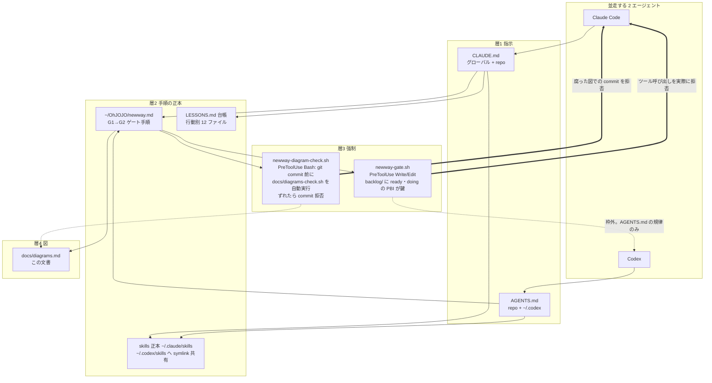
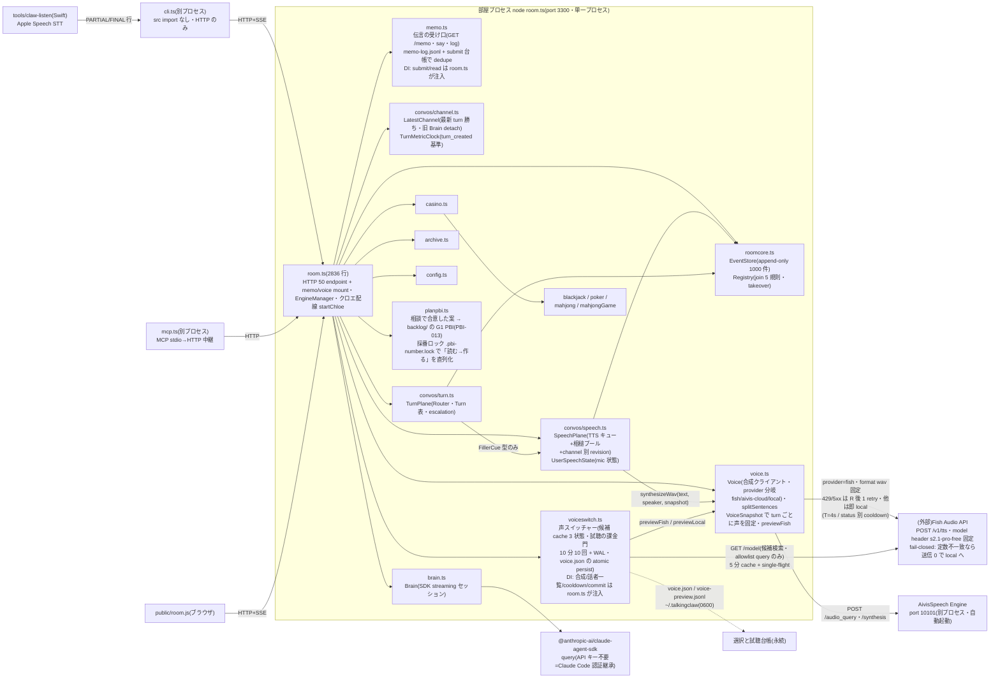
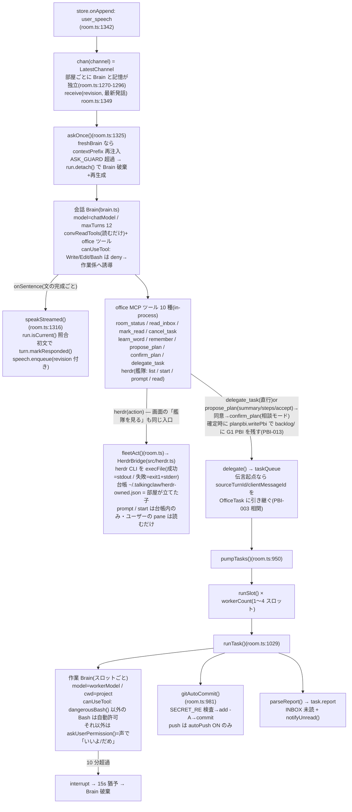
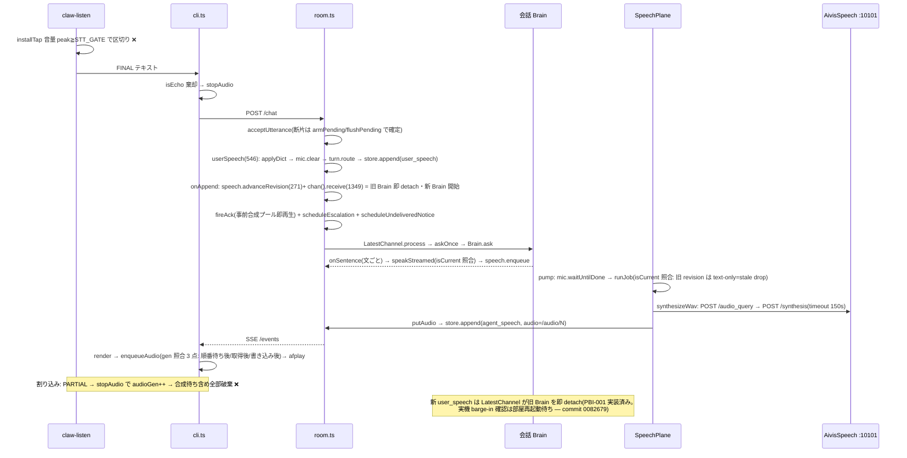
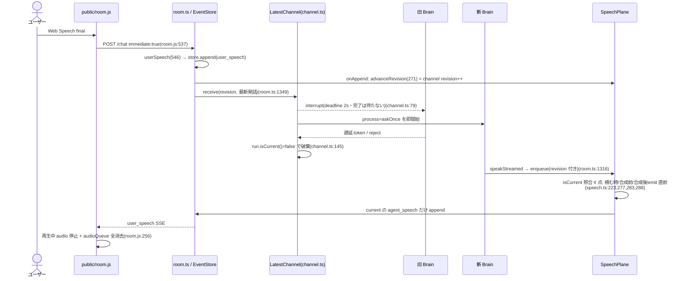
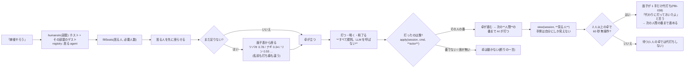
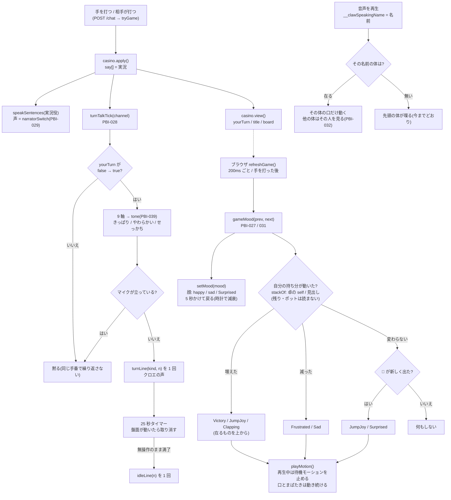
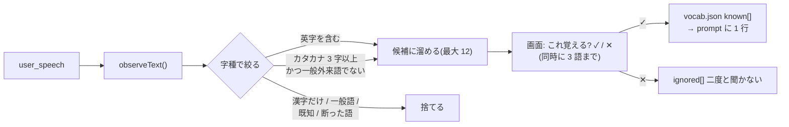
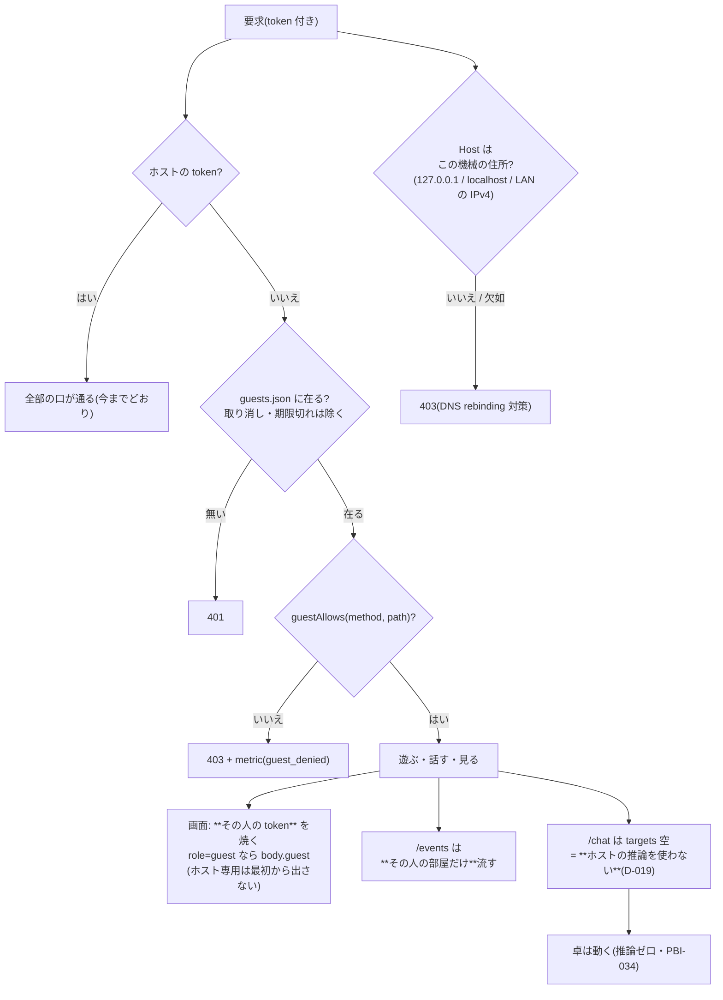
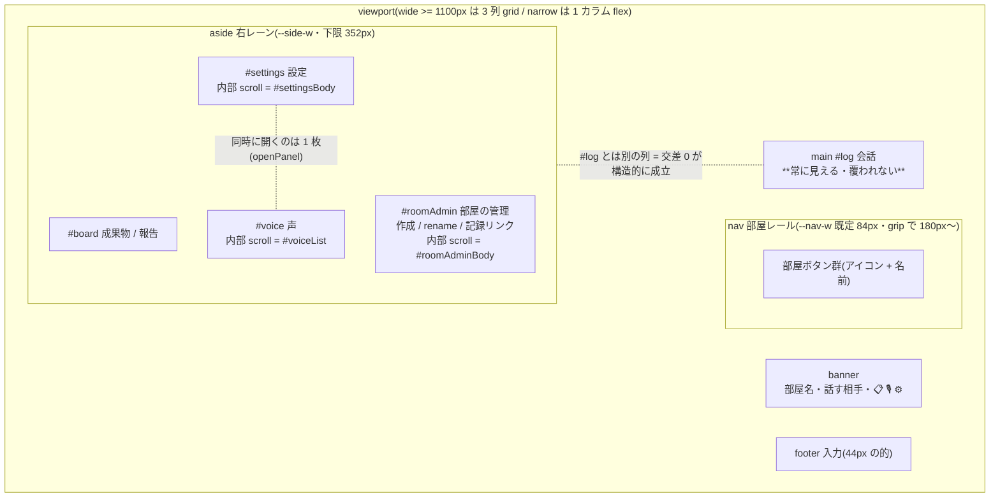

# talkingclaw 現時点の図(2026-08-06 精密版)

出典: `src/*.ts`・`src/convos/*.ts` 全文精読、`public/room.js` の API 呼び出し grep、`.kaiwa-loop/handoffs/004.md`。
図中の endpoint 名・関数名・クラス名はすべて実在(行番号つき)。コードが変わったら同じ commit でこの図も直す。
(2026-08-06 二股統合: 精密版を土台に、Codex commit 0082679「cancel superseded turns」の
latest-turn 制御を図 4・5・6 へ反映。行番号は統合後のコードで再実測済み)

## 1. ガバナンス図 — 4 層と、誰が何に縛られるか



## 2. モジュール依存図(import 実測 — 存在しない依存は描いていない)



設計上の要点(コードから自明でないもの):
- **convos/ は room.ts を import しない**(一方向依存。依存は `SpeechDeps`/`TurnDeps` で注入 — `speech.ts:74-86`, `turn.ts:28-40`。channel.ts は Brain を `InterruptibleBrain` interface で受ける — `channel.ts:4-7`)
- **テキスト平面と音声平面の分離**: テキストは EventStore に append-only で不喪失、音声は失効しうるリース(`speech.ts:1-8`)
- cli.ts / mcp.ts は src を一切 import せず、部屋の状態は全部 HTTP 越し(mcp.ts:1-2「thin proxy」)
- **声の選択は turn 生成時の snapshot で固定する**(PBI-008 AC-6)。実行時に現在値を読むと queue 済み job が切替後の声になり、同一返答の途中で声が混ざる。`speech.ts` の `speakSentences` が 1 turn 1 回だけ `voiceSnapshot(pid)` を読み、全 job に配る。クロエ以外は常に null(= 既定の声のまま)
- **試聴は通常会話と別経路**(`Voice.previewFish`)。retry 0・PBI-007 の cooldown を読み書きしない・失敗してもローカル合成へ落とさない。会話用に同時実行 slot を 1 つ常に残す

## 3. API 依存表 — 全 50+3+3 endpoint × 中で働く関数 × 呼び出し元

呼び出し元の凡例: **B** = ブラウザ public/room.js、**C** = cli.ts、**M** = mcp.ts(コハク/Codex 等の外部 agent)、**P** = 外網(スマホ。Tunnel+Access 経由 — PBI-003)

### memo(3・memo.ts)— token gate より**前**に mount。origin は memo 限定規則(localhost または `MEMO_PUBLIC_ORIGIN` の exact Host/Origin)

| endpoint | 中で働く関数 | 呼び出し元 |
|---|---|---|
| GET /memo | memo.ts handle() → identity(Cf-Access ヘッダ・表示用)を JSON リテラルで埋めた HTML | P |
| POST /memo/api/say | say() → room.ts の memoSubmit adapter(永続 dedupe 台帳 → userSpeech channel=work 固定) | P |
| GET /memo/api/log | 永続 timeline の cursor 増分(reply/note/report は read adapter が正規化) | P(polling) |

### voice(3・voiceswitch.ts)— token gate より**後ろ**に mount(memo とは逆。声は部屋の持ち主の設定)

| endpoint | 中で働く関数 | 呼び出し元 |
|---|---|---|
| GET /voice/api/candidates | candidatesFor()(5 分 cache 3 状態 + single-flight)+ localCandidates() → allowlist した候補だけ返す | B(声パネル) |
| POST /voice/api/preview | preview() → 会話中なら 409・同一は 10 分 cache・10 分 10 回で 429・WAL 先行 → previewFish() → ephemeral WAV | B(▶ 試聴) |
| POST /voice/api/select | select() → validate → temp 0600 write/fsync → atomic rename → publish → onCommit(プール失効) | B(これにする) |

### 認証なし(6)— token 配布より前に置ける最小限だけ

| endpoint | 中で働く関数 | 呼び出し元 |
|---|---|---|
| GET /health | store.bootId を返すだけ | B / C healthy() / M healthOk() |
| GET / | index.html に token・bootId を埋めて配信(no-store) | B(token 配布の唯一の経路) |
| GET /vad/* | public/vad/ の onnx・wasm 配信 | B(ブラウザ側 VAD) |
| GET /room.js | UI スクリプト配信 | B |
| GET /avatar.js | キャラ描画スクリプト配信(PBI-022) | B(dynamic import) |
| GET /vendor/* | node_modules の ESM 配信。**three / @pixiv/three-vrm の .js だけ**(allowlist・`..` 拒否) | B(import map の行き先) |

### token 認証(40)— `authed()`: x-room-token ヘッダ or ?token=

> **GET の口は `if (req.method !== 'POST') return 404` より前に置く**(room.ts:2093)。
> 後ろに書くと常に 404 になる —— 2026-08-15 に `/persona` と `/avatars` で実際に踏んだ。
> 恒久の守り手 = `test/check-http-get.mjs`(部屋を起こして 200 を見る)

| endpoint | 中で働く関数 | 呼び出し元 |
|---|---|---|
| GET /uploads/* | uploadDir() から配信 | B(添付の表示) |
| GET /files[/*] | loadProjects() → traversal 拒否 → 成果物配信 | B(INBOX の 📦 リンク) |
| GET /transcript.md | transcriptTail() → markdown | B(リンク) |
| GET /persona | personaSummary() → 9 軸 + turns + top(PBI-021) | B(🌱)/ C(/persona) |
| GET /avatars | listAvatars() → ~/.talkingclaw/avatars/*.vrm の名前(PBI-022) | B(起動時に 1 回) |
| GET /avatars/&lt;name&gt; | 名前を検査して .vrm を配信(traversal 拒否) | B(GLTFLoader) |
| GET /vocab | 覚えた語 + まだ聞いていない候補(PBI-024) | B(発話のたび)/ C(/vocab) |
| POST /vocab | `remember` / `ignore` を人が決める(勝手に覚えない) | B(「これ覚える?」の ✓ / ✕) |
| GET /motions | `~/.talkingclaw/motions/*.vrma` の名前(PBI-025) | B(キャラ枠を開いた時) |
| GET /motions/&lt;name&gt; | 名前を検査して .vrma を配信(traversal 拒否) | B(VRMAnimationLoaderPlugin) |
| GET /archives.md | archiveIndexTail() | B |
| GET /archive.md | archiveRead() | B |
| GET /events | SSE: store.since() 再送 + store.onAppend() 購読 + 25s ping | B / C subscribe() |
| GET /channels | rooms・activeChannel | B |
| GET /participants | registry.all()・registry.presence()・turn.selected・mic.active | B / C showWho() |
| GET /audio/N | audioStore(合成済み WAV の置き場。putAudio() が書く) | B の Audio / C enqueueAudio() |
| POST /upload | 20MB 上限で uploadDir() へ保存 | B |
| POST /intake | 落とされたフォルダの中身を 1 ファイルずつ受け、`~/claw-workspace/<名前>/<相対パス>` に置く(`..` は弾く)。開閉は /projects の intakeStart / intakeDone(PBI-017) | B(作業先パネルの落とし口) |
| POST /join | registry.join(5 規則) → resolveVoice() → speech.buildAckPool() | M ensureJoined() |
| POST /game | casino.view() | B(ゲーム盤のボタン生成) |
| POST /chat | tryGame() 即判定 → acceptUtterance()(断片確定)or userSpeech()(immediate) | B / C(入力・音声とも) |
| POST /dict | learnWord() / saveDict()(聞き間違い補正辞書) | B / C /dict |
| POST /memory | memoryLines() / appendMemory() / writeMemory() | B |
| POST /settings | workerSettings 更新 → saveSettings() → chloeResetWorker()/chloeResetChat() | B / C /settings |
| POST /projects | 作業先の一覧 / 追加 / 登録解除 → saveProjects()(temp→rename 原子的、PBI-011)。clone は ghPath()→ghClone()(spawn detached + グループ kill)で外部プロセス gh に委任し、成功時だけ saveProjects(PBI-012)。repos = `gh repo list --json` / browse = readdirSync で ~ を辿る(PBI-015 の「選ぶ」材料) | B |
| POST /herdr | fleetAct() → HerdrBridge(src/herdr.ts)= herdr CLI の thin adapter。list / start / prompt / read。書込みは台帳内だけ(PBI-014) | B(作業タブの「herdr の艦隊を見る」) |
| POST /ui-state | uiState 更新(クロエが room_status で読む) | B |
| POST /inbox | officeTasks の report 付きを返す | B / C /inbox |
| POST /task | 台帳手入れ: delete / cancel / edit / merge(working は拒否) | B |
| POST /inbox/read | t.unread = false | B / C |
| POST /inbox/delete | スレッド削除 | B |
| POST /inbox/reply | chloeReply() → taskQueue 再投入(同スレッドの続き) | B / C |
| POST /tasks | boardSnapshot() + fleetView(最後に見た herdr の艦隊。ここでは herdr を叩かない) | B / C /tasks |
| POST /plan | confirmPlan() → planPbi() → planpbi.writePbi(相談モードの案。確定時に backlog/ へ G1 PBI を書き、pbi/note を返す)/ 取り下げ | B |
| POST /transcript | transcriptTail()(JSON) | C /log / M recall |
| POST /screen | 在室・routing・speaking・board・直近ログを 1 発で | M look |
| POST /metrics | metrics.jsonl へ追記(stt_final_delay 等) | B |
| POST /select | turn.select()(話し相手の固定) | B |
| POST /rooms | newRoomId() / saveRooms()(create / rename、上限 12) | B |
| POST /invite | participantRoom.set()(別部屋の相手を呼ぶ) | B |
| POST /channel | activeChannel 切替 | B / C /room |
| POST /speech-state | mic.report() → true→false で flushPending()(断片確定の起点) | B(STT interim/final) |
| POST /played | turn.advanceFloor()(floor 前進)/ turn.onFillerPlayed()(escalation 前倒し) | B(再生完了通知) |

### participant 認証(4)— `registry.auth(participantId, sessionId)`

| endpoint | 中で働く関数 | 呼び出し元 |
|---|---|---|
| POST /heartbeat | lastSeen 更新(alive 判定 2.5 分) | M(60s 毎) |
| POST /leave | registry.leave() + waiter を no_speech 解決 | (現状呼び出し元なし) |
| POST /speak | clientSeq 冪等 → turn.attribute()(turn 帰属+窓閉じ)→ speech.speakSentences() | M speak |
| POST /listen | resolveListen()(即答)or waiters に long-poll 登録(最大 48s) | M listen |

## 4. クロエの内部構造 — 会話 Brain・作業係・office ツール(room.ts:847-1370)



- 声のパーミッション: allow-list 外ツール → `askUserPermission()`(room.ts:585)が部屋に「許可待ち」を流し、次の user 発話を `PERM_YES/PERM_NO` 正規表現で判定。許可待ちの読み上げは `advanceRevision` で直前の読み上げより優先(room.ts:593)
- 会話 Brain 再生成時は `contextPrefix()` で記憶全文 + 直近ログ 60 行を再注入(room.ts:1300-1314)。**これが会話遅延の支配項**(履歴肥大、メモリ `talkingclaw-chat-latency` 参照)
- 旧 `drain()/askGuarded()` の直列 chain は PBI-001 で LatestChannel に置換(中断完了を待たず新 turn を開始する — channel.ts:2)

## 5. 音声会話・割り込みシーケンス(関数名レベル。❌ = 実機未検証 — handoff 004 §4)



実機確認の手順: `ON_DEVICE=1 STT_LOCALE=en-US npm run cli /v` → ①送信が 1 回で済むか ②声が出る前の割り込みで `(割り込み)` が出るか ③独り言が混ざらないか。

## 6. 同期部屋の latest-turn 制御(PBI-001 — commit 0082679)



世代の発行源は `SpeechPlane` の channel 別 `#revisions`(speech.ts:115・136)の 1 つで、`LatestChannel.revision` は receive ごとにその絶対値を受け取る(channel.ts:88-93)。
別 channel は別 `LatestChannel`・別 revision なので中断されない。EventStore/transcript は append-only のまま、取消後に到着した旧 AI 出力だけを境界で捨てる。
取消時は onCancel が `turn.cancelEscalation` + `turn_cancelled` metric を出す(room.ts:1287-1292)。turn metrics は `TurnMetricClock`(channel.ts:11)が turn_created 基準の path('room'|'memo')・ms を付ける。

## 再測手順(recipe — newway §16-7)

この図が正しいかは「ちゃんと描いたか」ではなく、**下を再実行して数が合うか**で判定する。
コードを変えた PBI の G2 で再実行し、ずれていたら図が腐っている — 同じ commit で図を直す。

```bash
cd /Users/YOUR_USER/talkingclaw

# 図3: endpoint 全量 — 期待 43 行(4 認証なし + 33 token + 4 participant + memo mount 1 行
# + voice mount 1 行)。memo / voice の 3+3 endpoint はそれぞれの module 側 = 次の grep で 3・3
# 注: パターンは "path === '/" のように '/ まで含める。'/ 無しだと TurnPath('room'|'memo')の
# 比較 path === 'memo' を拾って +2 に化ける(2026-08-06 実測)
grep -c -e "path === '/" -e "path\.startsWith('/" src/room.ts
grep -c "pathname === '" src/memo.ts
grep -c "pathname === '" src/voiceswitch.ts

# 図2: モジュール依存の辺 — 期待 27 行(room 11 / speech 2 / turn 2 / voiceswitch 1 / casino 4 / mahjongGame 1 / index 3 / smoke 3)
# 注: '../ (convos → 親) を拾うため 2 パターン必須。片方だけだと減る(2026-08-06 実測)
grep -r -e "^import .*from '\./" -e "^import .*from '\.\./" src/ | grep -c "import"

# 図3 呼び出し元 B 列: ブラウザが叩く口(post 21 種 + fetch/EventSource 5 種)
grep -o "post('/[a-z./-]*" public/room.js | sort -u
grep -o "fetch('/[a-z./-]*\|EventSource('/[a-z]*" public/room.js | sort -u

# 図3 呼び出し元 C / M 列: CLI・MCP が叩く口
grep -o "api('/[a-z./-]*" src/cli.ts src/mcp.ts | sort -u

# 図4・図5・図6: 図中の関数が実在するか(名前を変えたらここで落ちる)
grep -c -e "function acceptUtterance" -e "function userSpeech" -e "function askUserPermission" src/room.ts
grep -c -e "function enqueueAudio" -e "function stopAudio" -e "function handsfreeLoop" src/cli.ts
grep -c -e "class LatestChannel" -e "class TurnMetricClock" src/convos/channel.ts

# render 検証 — 期待 5 図・エラー 0
npx -y @mermaid-js/mermaid-cli -i docs/diagrams.md -o /tmp/diagrams-check.md
```

## 7. 遊ぶ時の 3 本の流れ(PBI-025 / 027 / 028 / 029 / 034)

**卓に着く前に席が埋まる(PBI-034)**: 人数が足りないぶんだけ、名前と打ち癖を持った面子が座る。
**ここは推論を 1 回も使わない**（鍵が無くても卓が立つ = D-019 の土台）。




**盤面が動いた 1 回の更新**で、体・声・記憶がそれぞれ独立に動く。判定はすべて**数字か状態**で、
文字列の言い回しには依存しない（言い回しはゲームごとに変わるので、そこを読むと静かに壊れる）。



**「聞いて覚える」(PBI-024 / 026)** は会話の側の流れ。ゲームとは独立に、発話が入るたびに走る。



## 7-2. ゲストが入る時の関所（PBI-035・W4）

**「入れる」と「何でもできる」を分ける。** 鍵は 2 種類あり、ゲストは allowlist の口しか叩けない。
**どこまで出すか**は別の軸（PBI-036）: 既定は `127.0.0.1` だけ、`ROOM_BIND=0.0.0.0` で LAN。
出す先を広げても、通す Host は**列挙一致のまま**。
**新しい口を足しても既定で通らない**（忘れても穴が開かない形）。



## 8. UI 構造図 — 矩形の契約(正本は assert・px は参考値)

**この図の正本は下の契約表**(どの要素が・どの状態で・何を満たすか)。座標 px は撮影日付きの
参考値に過ぎない — CSS を変えれば腐るし、`diagrams-check.sh` は px の腐りを検出できない。
契約の側は `test/check-ui-geometry.mjs` が実行時に測るので、破れたら赤で分かる。



### 契約(= `test/check-ui-geometry.mjs` の assert。破れたら赤)

| # | 対象 | 状態 | 満たすこと |
|---|---|---|---|
| C1 | `#settings` / `#voice` | 開 | content 幅 >= **320px**(測る箱 = `#settingsBody` / `#voiceList` の clientWidth) |
| C2 | パネル ∩ `#log` | 開 | 矩形交差 **0** |
| C3 | `#log` | 常時 | 高さ >= **35dvh**。narrow では `min-height: 35dvh` が構造的な下限 |
| C4 | パネル内部 | 開 | 内部 scroll を持つのは**本体 1 つだけ**(`#settingsBody` / `#voiceList`) |
| C5 | label / 見出し / ボタン | 開 | 折返し **<= 3 行**(`Range.getClientRects()` の line box 数)。母集団 >= 7 件でなければ検査自体を fail |
| C6 | 同上 | 開 | 切詰め(nowrap/ellipsis/line-clamp)で 3 行以内を偽装しない。**省略してよいのは accessible な全文がある時だけ** |
| C7 | control | 開 | touch target >= **44px**(label に包まれた control は label が的) |
| C8 | パネル自身 | 開 | 画面の外へはみ出さない(起票時の `y=-12,726` の再発防止) |
| C9 | 辞書 / 記憶の行 | 開 | 文字が縦積みにならない(span の折返し <= 2 行)・消すボタンが行内 |
| C10 | 全体 | 常時 | 横 overflow **0** |
| C11 | パネル | resize | リロード無しの resize で**勝手に閉じない**。3 サイズ往復で C1〜C10 が成立し続ける |
| C12 | 右レーン幅 | grip drag / 保存値復元 | 下限 **396px**(実測: lane→content で 66px 失われる)。`tc-side-w` に永続するので、下限を割ると次回以降ずっと読めない。**drag 最小化した状態**と**下限未満の保存値で起動した状態**の両方で content >= 320 を実測する(AC-8) |
| C13 | `.grip` | wide | computed 幅 **9px**(掴める)。`.lane > *` の `width: auto` に負けて 0px になっていた実績あり |
| C14 | `#roomsExtra`(部屋作成フォーム) | 開 | box 幅 >= **320px**・`#log` 交差 0・**打鍵中に再構築されない**(SSE 再描画で focus と値が飛ばない)。rail 内の `position:fixed` 吹き出し(280px)は廃止 |
| C15 | 話す相手チップ | 描画 | accessible name は agent 名のみ。居場所は `aria-hidden` の副題(`aria-label` で補う)。text node + span の連結による 1 語融合を作らない |

### 参考値(2026-08-06 実測・修理後。**契約ではない**)

| viewport | 設定パネル content | `#log` | 交差 |
|---|---|---|---|
| 1440x900 | 509px | 690px(35dvh=315) | 0 |
| 1024x768 | 794px | 317px(35dvh=269) | 0 |
| 390x844 | 332px | 316px(35dvh=295) | 0 |
| 1440x900(右レーンを最小まで drag) | 329px | 690px | 0 |

修理前(a522e2c)の同じ測定: 設定 content **38px** / `#log` 173〜198px = C1・C3 違反。
負の対照はこの数値で赤くなることを確認済み(`UI_GEOM_BASELINE=a522e2c node test/check-ui-geometry.mjs`)。
