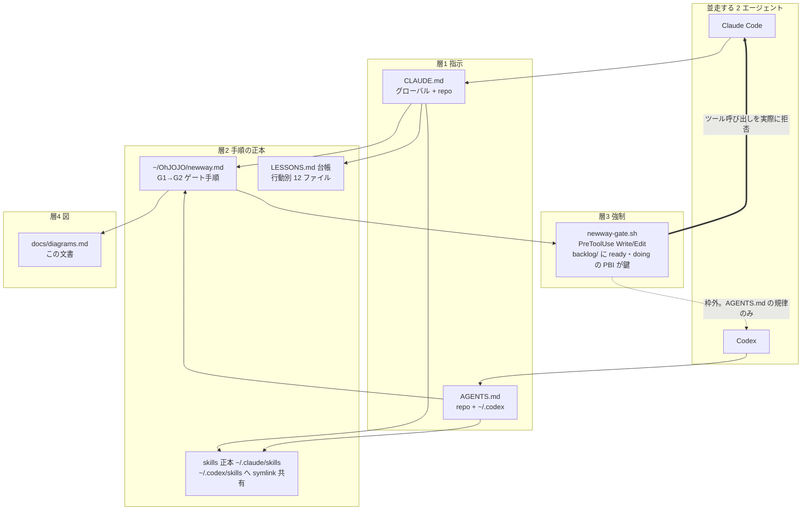
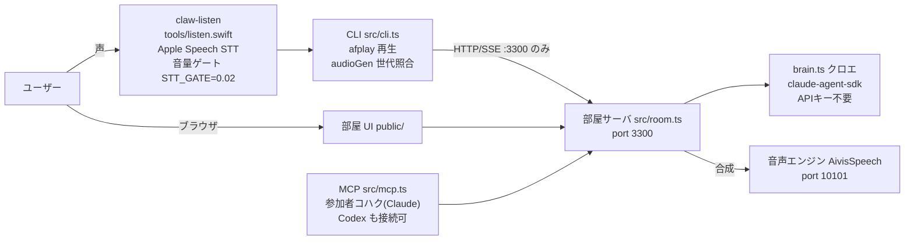
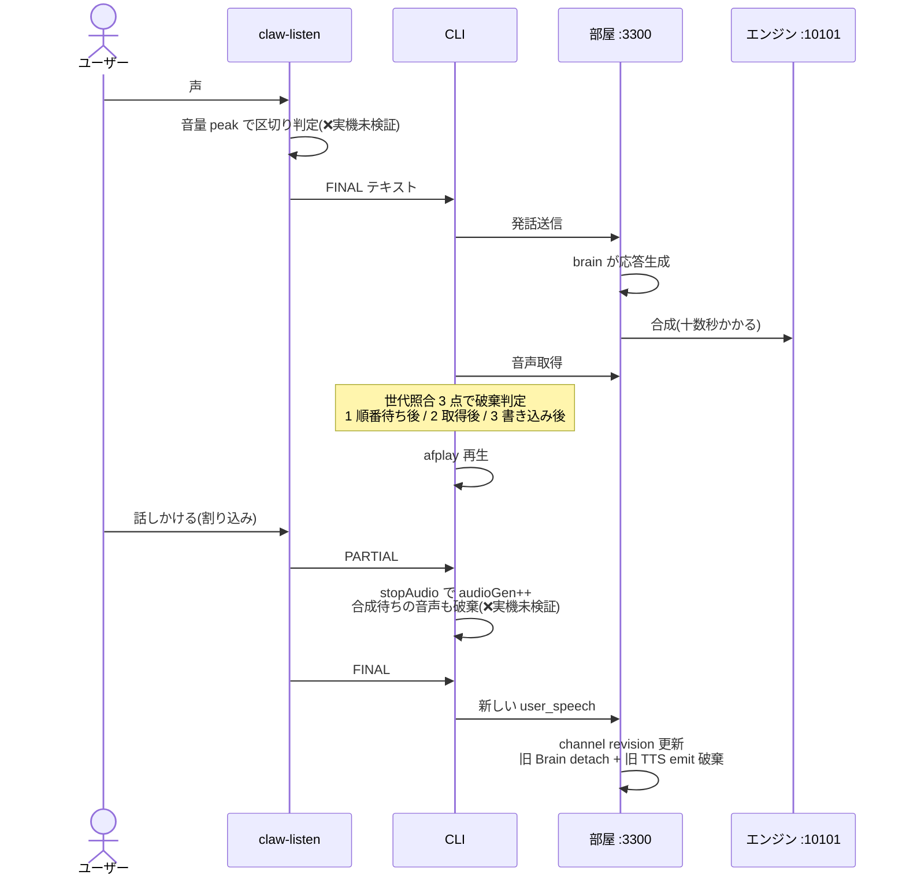
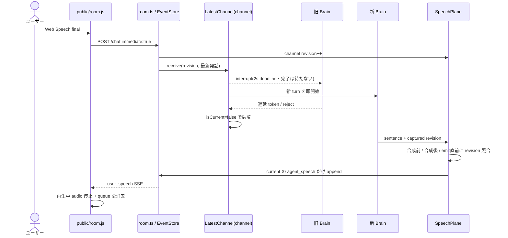

# talkingclaw 現時点の図(2026-08-06)

出典: `CLAUDE.md` / `AGENTS.md` / `.kaiwa-loop/handoffs/004.md` / `src/{cli,room,config,brain,mcp}.ts` の grep 実測。
コードから自明でない構造だけを描く。コードが変わったらこの図も同じ commit で直す(嘘の図は消す方がまし)。

## 1. ガバナンス図 — 4 層と、誰が何に縛られるか

拘束の非対称(意図した設計): Claude は hook で止まる。Codex は止まらない — Codex への強制は
AGENTS.md の記述だけなので、**Codex の実装編集は PBI の存在を人が確認する**。
共有資源: MCP 4 つ(context7 / playwright / obsidian / talkingclaw)、`.kaiwa-loop/handoffs/`(着手・完了宣言)、`backlog/`。
並走規約: worktree 分離・main へは直列 merge(repo `AGENTS.md` 並走 5 か条)。

## 2. 構成 + デプロイ図 — 何がどのポートで動き、どう繋がるか

grep 実測: CLI の fetch 先は部屋(`:3300`)のみ(`cli.ts:39,67,95,248`)。TTS の URL は `config.ts:8`(`:10101`)。
brain は `@anthropic-ai/claude-agent-sdk` の `query`(`brain.ts:1`)。
**部屋(3300)とエンジン(10101)のプロセスは止めない**(`CLAUDE.md` ルール 4)。

## 3. 割り込み(barge-in)シーケンス — 現在地(handoff 004)

❌ = 実機未検証(handoff 004 §4-1: 検証中に Apple 音声認識が沈黙し確認できていない。変更前バイナリでも沈黙するため変更起因ではない)。
実機確認の手順: `ON_DEVICE=1 STT_LOCALE=en-US npm run cli /v` → ①送信が 1 回で済むか ②声が出る前の割り込みで `(割り込み)` が出るか ③独り言が混ざらないか。

## 4. 同期部屋の latest-turn 制御(PBI-001)

世代の発行源は `SpeechPlane.revision(channel)` の 1 つで、`LatestChannel.revision` は user_speech ごとにその絶対値を受け取る。
別 channel は別 `LatestChannel`・別 revision なので中断されない。EventStore/transcript は append-only のまま、取消後に到着した旧 AI 出力だけを境界で捨てる。
